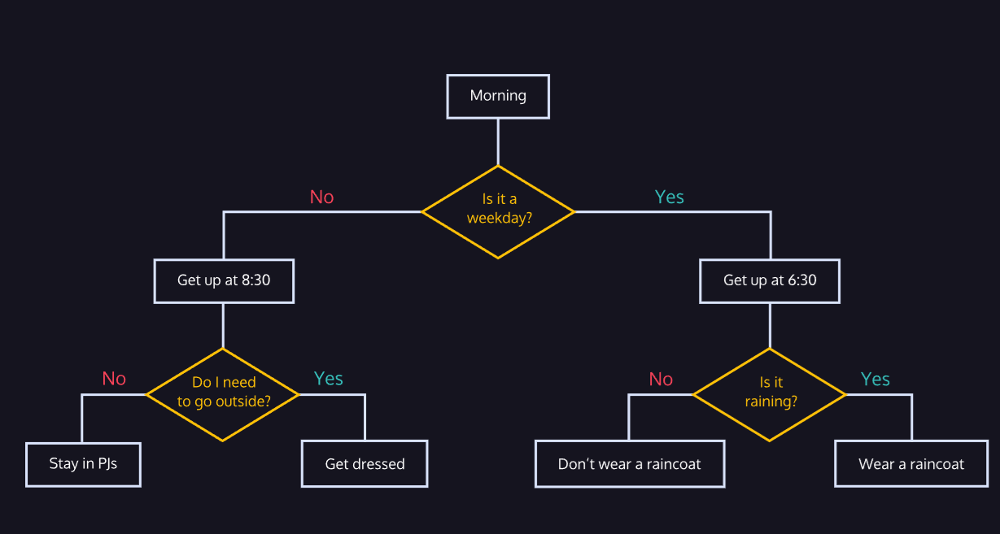

link to lesson:
https://www.codecademy.com/courses/learn-python-3/lessons/python-control-flow/exercises/introduction

link to folder

/c/Users/glads/Downloads/LEARN-PYTHON3/CONTROL-FLOW/CONTROL-FLOW-Introduction-to-Control-Flow

### CONTROL FLOW

# Introduction to Control Flow

Imagine waking up in the morning.

You wake up and think, “Ugh. Is it a weekday?”

If so, you have to get up and get dressed and get ready for work or school. If not, you can sleep in a bit longer and catch a couple extra Z’s. But alas, it is a weekday, so you are up and dressed and you go to look outside, “What’s the weather like? Do I need an umbrella?”

These questions and decisions control the flow of your morning, each step and result is a product of the conditions of the day and your surroundings. Your computer, just like you, goes through a similar flow every time it executes code. A program will run (wake up) and start moving through its checklists, is this condition met, is that condition met, okay let’s execute this code and return that value.

This is the control flow of your program. In Python, your script will execute from the top down, until there is nothing left to run. It is your job to include gateways, known as conditional statements, to tell the computer when it should execute certain blocks of code. If these conditions are met, then run this function.

Over the course of this lesson, you will learn how to build conditional statements using boolean expressions, and manage the control flow in your code.

see flow chart below

